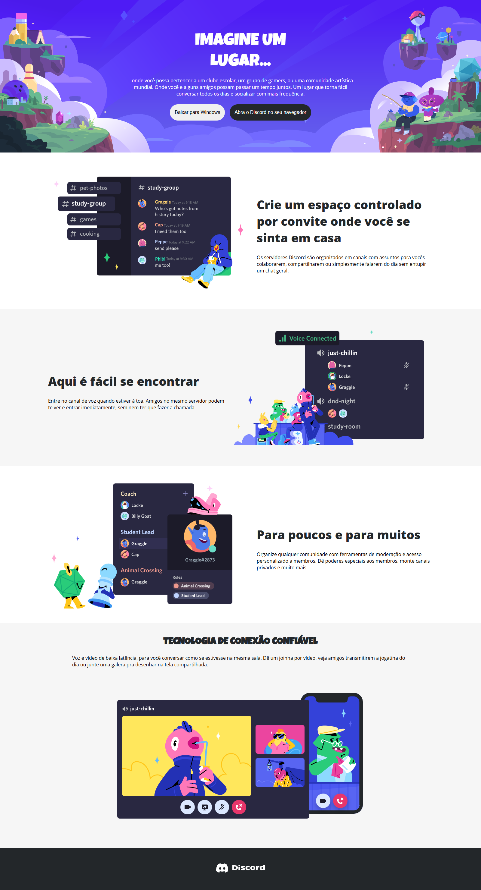

# Projeto CSS - Landing Page Responsiva

## 📸 Prévia

### Versão Desktop

> *Imagem ilustrativa da versão desktop do site.*

### Versão Mobile

> *Imagem ilustrativa da versão para celulares.*

---

## 🧠 Sobre o Projeto

Este projeto faz parte da formação CSS da [Dio.me](https://www.dio.me/). A proposta foi criar uma **landing page responsiva**, inspirada no visual do Discord, praticando o uso de:

- `Flexbox`
- `Media Queries`
- Organização de conteúdo por seções
- Responsividade realista em diversos tamanhos de tela
- Fontes externas do Google Fonts

O destaque do projeto é a **adaptação do layout para dispositivos móveis**, alterando a estrutura de colunas para blocos verticais em telas menores, além de centralizar e redimensionar elementos importantes.

---

## 🛠️ Tecnologias Utilizadas

- HTML5
- CSS3
- Flexbox
- Media Queries
- Google Fonts

---

## 🔗 Visualizar Projeto

Você pode visualizar o projeto clicando no link abaixo:

**[🔗 Acesse a página](https://luis-fellipe.github.io/landing-page-discord-responsiva/)**  

---

## 👨‍💼 Contato

Você pode me encontrar no LinkedIn:  
[www.linkedin.com/in/luis-fellipe-real](https://www.linkedin.com/in/luis-fellipe-real)
